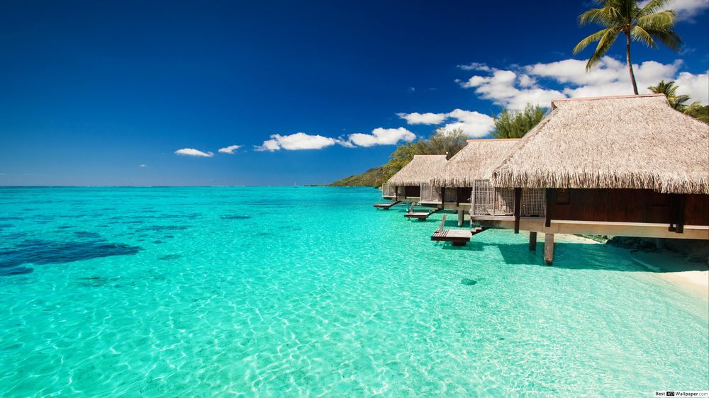

[About](/about)

# My second repository

Holiday moods

Would be great to be there now...

The Maldives are known as “the tropical paradise” for reasons such as its beauty. This tropical country has separated islands and islands are surrounded by its own lagoon. Each island has pure white sandy beaches. ... A vacation in the Maldives would be relaxing with the white sand beaches and coconut palms surrounded.

## General information:

Maldives, in full Republic of Maldives, also called Maldive Islands, independent island country in the north-central Indian Ocean. It consists of a chain of about 1,200 small coral islands and sandbanks (some 200 of which are inhabited), grouped in clusters, or atolls.

[Dataprotection](/Dataprotection)
[Imprint](/Imprint)
